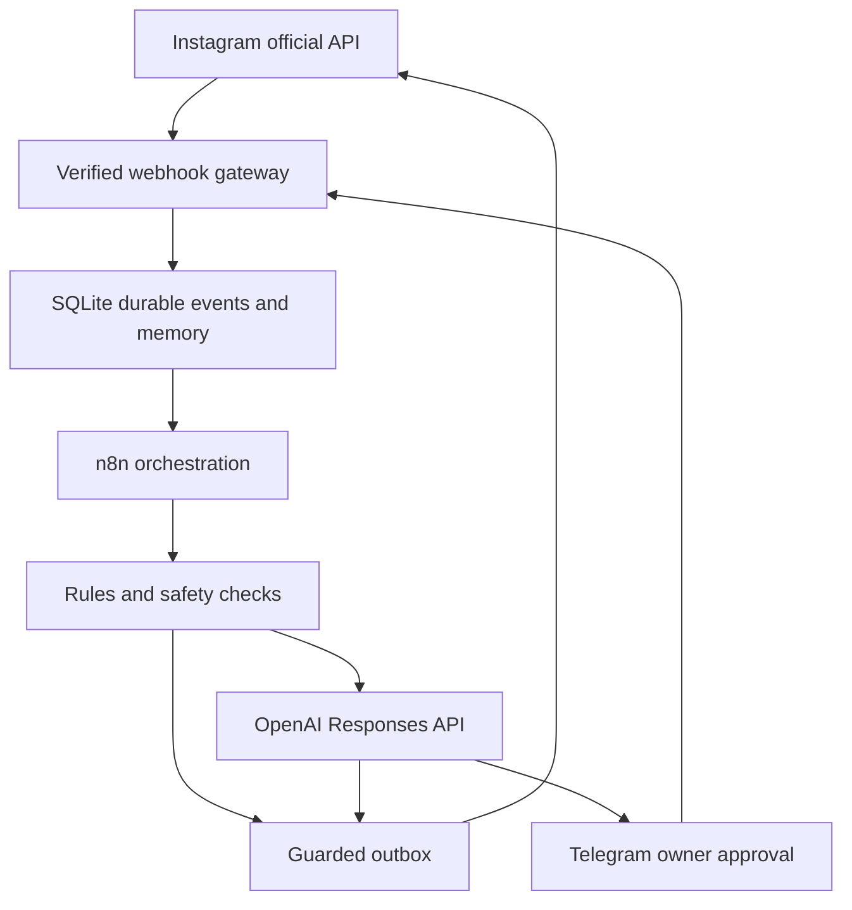

# PCL Instagram AI Assistant

**وضعیت:** کد و تست‌های محلی آماده‌اند. اتصال واقعی Meta، OpenAI و تلگرام و استقرار دائمی هنوز انجام نشده است. هیچ دایرکت واقعی برای تست ارسال نشده. قوانین نمونه خاموش‌اند.

این پوشه سیستم مستقل Persian Creative Lab در مخزن موجود است. Codex ساخت و نگهداری را انجام می‌دهد؛ پاسخ روزمره با OpenAI API تولید می‌شود. اجرای OpenReply برای این سیستم لازم نیست.

## استفادهٔ مالک

شما فایل کد، GitHub یا n8n را ویرایش نمی‌کنید. درخواست را به Codex می‌گویید:

> اگر کسی زیر این ریلز نوشت وکیل، این متن را برایش دایرکت کن.

Codex شناسهٔ ریلز و متن دقیق را ثبت می‌کند و قانون را از API مدیریتی اعمال می‌کند. این API آماده است؛ تبدیل آزادِ هر جملهٔ فارسی به قانون در خود ربات تلگرام هنوز پیاده نشده است. در تلگرام قالب متنی ساده برای افزودن قانون، نمایش قوانین و خاموش/روشن کردن آن‌ها موجود است.

برای سؤال قیمت، سفارش، تخفیف، همکاری، شکایت یا پاسخ نامطمئن، تلگرام پیشنهاد و سابقهٔ کوتاه را نشان می‌دهد. با **تأیید، ویرایش، رد، پاسخ دلخواه** تصمیم می‌گیرید. ویرایش ابتدا پیش‌نمایش جدید ایجاد می‌کند؛ باید دوباره تأیید شود. پیام جدید مخاطب، پیش‌نویس قدیمی را بی‌اعتبار می‌کند.

فرمان‌ها: `/rules`، `/status`، `/pause`، `/resume`، `/help`. توقف از تلگرام روی ارسال‌های آینده اثر می‌گذارد؛ پیامی که قبلاً به Meta ارسال شده قابل پس‌گرفتن نیست.

## Architecture



Meta → verified gateway → durable event → n8n → rule/AI → outbox → Instagram. Telegram uses its own authenticated webhook and the same durable outbox. This small gateway precedes n8n to authenticate the original request bytes and persist every event before acknowledging Meta. n8n handles scheduling and orchestration; the Python runtime owns security, classification, memory, approvals and delivery guarantees.

SQLite is selected because no working connected database was found. Single account, single process, persistent local volume. No Redis or paid database required. Keep the original OpenReply services separate; no migration or deletion is performed.

## Services and costs

- Python gateway: standard-library business logic + Gunicorn server.
- Self-hosted n8n Community: separate persistent SQLite volume.
- Official Meta Instagram Login API; Telegram Bot API.
- OpenAI API is metered separately from a ChatGPT subscription. Default `gpt-4.1-mini`; current verified rates $0.40 input/$1.60 output per million tokens. Example: 1,000 AI calls with 1,000 input + 150 output tokens each ≈ $0.64, excluding longer contexts and retries. This is an illustration, not a billing guarantee. Rules and greetings make zero model calls. Daily AI call cap defaults to 100, context to 12 messages, output to 450 tokens.
- Hosting: provider-neutral Docker Compose. Reuse an existing always-on server if available; no host has been provisioned. Railway already connected but its OpenReply deployment failed and has no volumes/secrets. Pricing reviewed: Hobby has $5 monthly minimum with usage charged above included credits. Its limited free tier must not be described as guaranteed free always-on hosting for both services. No paid resource was created.

## Workflows

| File | Purpose |
|---|---|
| `workflows/pcl-receive.json` | A: lease events, fan out each event, DM/comment/story rules and OpenAI decision |
| `workflows/pcl-approval.json` | B: process authenticated Telegram actions and owner commands |
| `workflows/pcl-send.json` | C: policy checks, Meta/Telegram delivery, sanitized logs |
| `workflows/pcl-maintenance.json` | D: expiry, recovery, content retention |
| `workflows/pcl-error.json` | E: enqueue owner alert with execution ID only |
| `workflows/legacy/` | Three unchanged earlier PCL SAFE TEST workflows, preserved for reference |

Workflows have no embedded tokens and are inactive in git. The engineer-run installer attaches an n8n header credential and can activate them after commissioning. Export files are generated by `scripts/build_workflows.py`. Runtime modules are intentionally shared across trigger types to keep the workflow graphs small.

## Local setup — engineer reference

Owner does not execute this section. The engineer manages it.

```bash
cd pcl-assistant
python3 -m venv .venv
.venv/bin/pip install -r requirements.txt
python3 -m unittest discover -s tests -v
python3 scripts/doctor.py
```

Copy `.env.example` into an untracked `.env`, enter credentials through a secure environment/secrets interface, and run Docker Compose. Never post tokens in a public issue, commit, terminal output or chat screenshot. `.env` is not automatically loaded by standalone Python scripts: launch them with the environment injected by the host or container.

```bash
docker compose --env-file .env up -d --build
```

Gateway is local port 8080, n8n local port 5678. Health endpoint `/health`. Meta callback `/webhooks/meta`. Telegram callback `/webhooks/telegram`. Internal routes require the separate bearer token, even on the internal network.

## Deployment — engineer reference

1. Choose a host with durable volumes and sufficient memory for n8n; use one gateway replica. Do not deploy this SQLite configuration to ephemeral/serverless storage.
2. Inject environment secrets, pin verified n8n image (2.41.6 checked against registry), mount gateway and n8n volumes.
3. With a real domain pointed at the host, start `compose.yml` plus `compose.production.yml`. Caddy obtains HTTPS. Public routing exposes only webhook and health paths; n8n administration stays on loopback/SSH tunnel. Account for Caddy's persistent volumes as well. For the owner-approved Railway trial and private automatic n8n provisioning, see [Railway trial commissioning](docs/railway-trial.md).
4. Engineer completes n8n owner setup, stores an API key securely, runs `scripts/install_workflows.py` with `N8N_API_URL`, `N8N_API_KEY`, `INTERNAL_API_TOKEN`, and optional `PCL_INTERNAL_URL`. API installer uses current public `/api/v1` workflow/credential endpoints. Start with workflows inactive; `ACTIVATE_WORKFLOWS=true` activates them only when ready. Current version import/execution must be tested; see validation report.
5. Run `scripts/commission_meta.py` and `scripts/telegram_webhook.py`, preserving pending Telegram updates.
6. Validate real test-account DM, story, comment and approvals in dry-run. Confirm access level/App Dashboard requirements. Only then enable `META_CAPABILITIES_VERIFIED=true`, `OUTBOUND_ENABLED=true`, `DRY_RUN=false`.
7. Back up gateway SQLite with `scripts/backup.py`; separately back up the n8n volume and encryption key. Restore drills should occur before enabling real sends. No scheduled backup destination has been provisioned yet.

A paid host or new recurring cost is not silently enabled. See `docs/inspection.md` and `docs/api-verification.md`.

## Meta requirements

Official docs checked 2026-10-03 via direct HTTPS:

- Instagram professional account (Business or Creator).
- This implementation uses **Instagram Login**, which does **not require a Facebook Page** connection. Facebook Login is a separate integration and is not mixed into this adapter.
- Scopes: `instagram_business_basic`, `instagram_business_manage_messages`; for comment intake/private replies also `instagram_business_manage_comments`.
- Valid Instagram User access token for the correct professional account. Configure `messages` and `comments` webhook fields and subscribed app.
- Owner must authorize their Meta app/account. App roles, Standard vs Advanced Access and feature availability must be verified in that actual app. Serving other accounts requires Advanced Access; do not assume owning an account automatically removes every review requirement.
- HTTPS callback verification and SHA256 raw-body app-secret signature validation are implemented.
- Routine messages/story replies use the 24-hour inbound-message window. Private comment replies use `recipient.comment_id`, one reply per comment, within 7 days of creation. Comments do not open an ordinary DM window. Live comments excluded.
- Meta currently documents text limit **1,000 UTF-8 bytes**, enforced for rules, edits and generated responses. Long prompts should use an approved link rather than splitting a private reply into multiple DMs.
- Missing comment creation time is fetched from the comment API; if unavailable the send is blocked. Webhook `entry.time` is not substituted.
- Token expiry/permissions are monitored through API failures and alerts; automatic OAuth renewal is not implemented yet. Owner reconnects through Meta authorization when necessary; engineer handles configuration.

## Telegram configuration

Use a dedicated bot. Owner creates/authorizes it with BotFather, then enters its token into secure host settings. Owner presses Start in the bot; engineer verifies numeric user ID and private chat. Callback access requires that exact owner ID, a private chat, stored Telegram message ID, current draft version and unexpired approval. `setWebhook` uses a separate secret header. Bot token is never an approval credential supplied by incoming messages.

## Environment variables

| Variable | Use |
|---|---|
| `DATABASE_PATH` | Persistent SQLite path |
| `IG_ACCOUNT_ID` | Professional account ID from authorized token |
| `META_ACCESS_TOKEN`, `META_APP_SECRET` | Meta credentials |
| `WEBHOOK_VERIFY_TOKEN` | Meta challenge secret |
| `META_GRAPH_API_VERSION` | Verified configurable Graph version; default v25.0 |
| `OPENAI_API_KEY`, `OPENAI_MODEL` | Metered runtime AI |
| `OPENAI_STRONG_MODEL` | Reserved; no stronger-model spending path enabled |
| `TELEGRAM_BOT_TOKEN` | Dedicated owner bot |
| `TELEGRAM_WEBHOOK_SECRET`, `TELEGRAM_OWNER_USER_ID` | Webhook and owner authorization |
| `INTERNAL_API_TOKEN` | n8n → runtime bearer credential |
| `DRY_RUN`, `OUTBOUND_ENABLED`, `META_CAPABILITIES_VERIFIED` | Three live-send commissioning gates |
| `AUTO_REPLY_CONFIDENCE`, `AI_DAILY_CALL_LIMIT`, `CONTEXT_LIMIT` | AI safety/cost limits |
| `APPROVAL_TTL_SECONDS`, `RETENTION_DAYS`, `SEND_PER_MINUTE` | Expiry/privacy/delivery limits |
| `N8N_ENCRYPTION_KEY`, `N8N_IMAGE` | Persistent n8n credentials and pinned image |
| `PUBLIC_HOST`, `N8N_HOST`, `N8N_WEBHOOK_URL` | Host routing |

`DATABASE_PATH` is a local database, so it has no network database password. Any future Postgres integration must add credentials through environment variables.

## Adding a keyword automation

Codex can call authenticated `POST /internal/rules` with `id`, `trigger` (`comment`/`dm`/`story`), `media_id`, `keyword`, `response`, `approval`, `active` and `priority`. Comment rules require a specific numeric post ID. Exact-post rules precede wildcard rules; Persian/Arabic ی/ک, diacritics and punctuation are normalized. Whole words/phrases match, preventing `وکیلک` from triggering `وکیل`.

Alternatively, the owner sends this plain message inside their private Telegram bot:

```text
/rule
id: lawyer-reel
trigger: comment
post: 1234567890
keyword: وکیل
reply: سلام، این لینک آموزش تأییدشدهٔ وکیل است: https://YOUR_REAL_LINK
approval: no
```

The engineer replaces the example post and link with verified owner content. No application-source modification is needed. Sensitive categories override rules. Use `approval: yes` for a rule requiring approval. Seed examples are inactive and never enabled automatically.

## Reliability and limitations

- Atomic event deduplication, processing leases, unique outbox per event, draft versions and context checks.
- Backoff for explicit rate-limit rejection only. Timeout/5xx/missing message ID/process crash are **unknown_delivery**, require manual reconciliation, and are not automatically resent. Meta send has no general guaranteed idempotency key; exactly-once delivery cannot be promised across an ambiguous provider outcome.
- Short context/lead states retained locally; raw message content redacted after retention while dedup tombstones remain.
- Live delivery, Meta review, token refresh, external backup and hosting remain commissioning work. Multimedia messages go to owner review. Username shown when available from comment events; for DMs ID is shown if username is absent.
- Grounding checks and structured outputs reduce hallucinations but do not prove every sentence correct. Populate confirmed knowledge, review real examples, and raise threshold or require all approvals when needed.

## Troubleshooting

| Symptom | Engineer action |
|---|---|
| No events | Check HTTPS challenge, HMAC secret, account ID and `messages`/`comments` subscriptions |
| Events waiting | Check n8n workflow activation, header credential and `/internal/jobs/claim` connectivity |
| No Instagram response | Check dry-run/outbound/pause gates, window, current context and approval state |
| `unknown_delivery` | Inspect Instagram thread before any manual retry; do not replay the webhook |
| Telegram button does nothing | Check owner/private chat, message ID, draft version, expiry and newer context |
| AI requires review | Check confirmed knowledge, API credentials, confidence and daily cap |
| Original OpenReply fails | Its Prisma schema is incomplete; independent of this runtime, do not run migrations blindly |
